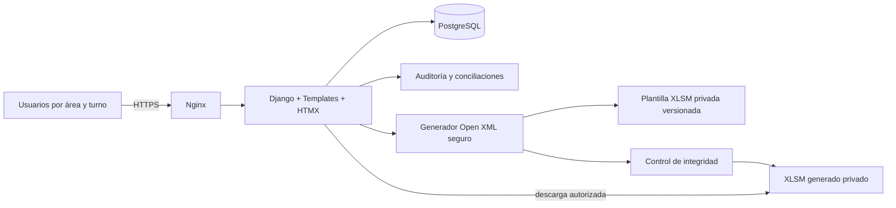

# Arquitectura

El motor de Excel trabaja sobre una copia temporal. Solo modifica XML de celdas autorizadas y `calcPr`; no abre Microsoft Excel ni toca `vbaProject.bin`, imágenes, estilos, dibujos o relaciones. El control compara hojas, estados, fórmulas, VBA, celdas no autorizadas y componentes del paquete antes de registrar un archivo como válido.
